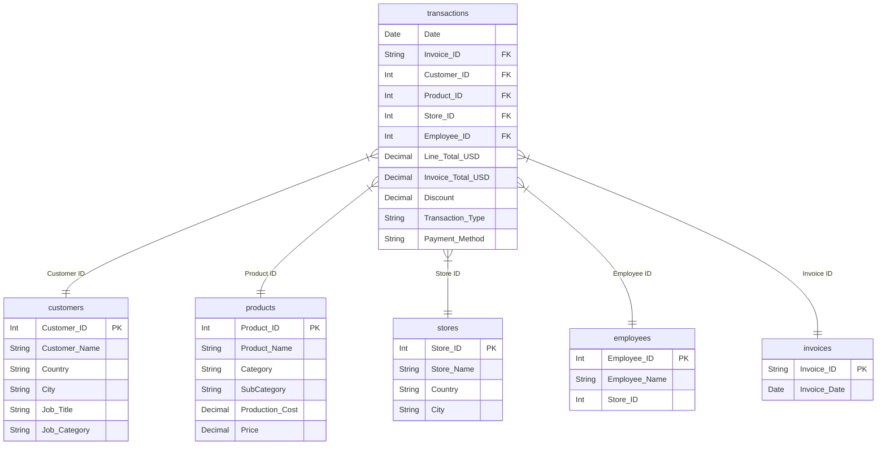

# MAVYN Retail Analysis & Business Intelligence

## Graduation Project Submission
**Data Cleaning, Modeling, and interactive Business Intelligence Dashboards**

---

## 👥 Team Members
* **Zyad Mohamed Alaaeldien**
* **Sahar Alaa Mohamed**
* **Mahmoud Osama Khattab**
* **Joyce Nardeen Nabil**
* **Fathy Raed Muhammad**

---

## 📊 Project Overview
This project focuses on analyzing **MAVYN's** global retail fashion chain data to extract strategic business insights. The analysis spans transactional data across **35 physical stores** in **7 countries** (United States, China, Germany, United Kingdom, France, Spain, Portugal) for the time period of **2020 – 2024**.

The source dataset comprises over **6.4 million transactions**, presenting key data engineering, normalization, and visualization challenges.

### Key Project Metrics
* **Total Net Revenue:** $211,956,524.31 (USD)
* **Total Transactions:** 4,540,404
* **Total Units Sold:** 7,060,071
* **Active Customer Base:** 783,217 customers
* **Product Catalog:** 17,940 products
* **Physical Outlets:** 35 stores

---

## 🏗️ Data Architecture (Star Schema)
The analytical model follows a standardized **Star Schema** design in both Power BI and Tableau. The central fact table is `transactions`, linked to five primary dimension tables via Active one-to-many relationships:



---

## 🗃️ Repository Contents

This repository contains the core deliverables for the MAVYN graduation project:

| File Name | Description |
| :--- | :--- |
| 📊 **[MAVYN (Final).pbix](MAVYN%20(Final).pbix)** | **Power BI Desktop Dashboard** containing the cleaned tables, star schema model, advanced DAX measures, and interactive reporting pages. |
| 📝 **[MAVYN_Project_Documentation.docx](MAVYN_Project_Documentation.docx)** | **Comprehensive Project Documentation** (Project Planning, Stakeholder Analysis, Requirements, Data Quality Issues & ETL, DAX Formulas, and Final Insights). |
| 🎨 **[Tableau_Project_Documentation.docx](Tableau_Project_Documentation.docx)** | **Tableau Dashboard Documentation** outlining the financial, product, and geographical analysis dashboards built inside Tableau. |
| 💻 **[dax_formulas.txt](dax_formulas.txt)** | **Source Code File** containing all plain-text DAX Calculated Columns and DAX Measures created for analytical reporting (easy for code review directly on GitHub). |
| 📁 **[trash/](trash/)** | Archive folder containing raw data schemas, intermediate logs, scripts, and temporary extraction artifacts (cleanly separated from the final deliverables). |

---

## 🛠️ Advanced Analytics & DAX Formulas
All data manipulation and business metrics were calculated using optimized DAX code. Examples of core measures implemented in the model include:

### Average Order Value (AOV)
```dax
AOV = DIVIDE([Total Revenue], [Total transactions], 0)
```

### Customer Lifetime Value (CLV)
```dax
CLV = [AOV] * [Purchase Frequency] * [Gross Margin %] * [AVG CL(month)]
```

### New vs. Returning Customer Classification (Calculated Column)
```dax
Customer Type = 
VAR FirstPurchase =
    CALCULATE(
        MIN(transactions[Date]),
        ALLEXCEPT(transactions, transactions[Customer ID])
    )
RETURN
    IF(transactions[Date] = FirstPurchase, "New", "Returning")
```

> [!NOTE]
> The full source code for all **50+ DAX measures** and **Calculated Columns** is categorized and documented in the **[dax_formulas.txt](dax_formulas.txt)** file.

---

## ⚠️ Important Note on GitHub File Sizes
The primary Power BI file (`MAVYN (Final).pbix`) is **224 MB**, which exceeds GitHub's standard upload limit of **100 MB**. 

* **Option 1 (Git LFS):** We recommend using **Git LFS (Large File Storage)** to track and push this file:
  ```bash
  git lfs install
  git lfs track "*.pbix"
  git add .gitattributes
  git add "MAVYN (Final).pbix"
  git commit -m "Add Power BI project file"
  git push origin main
  ```
* **Option 2 (Alternative Cloud Link):** If you are downloading the repository directly from the GitHub web interface and cannot access the large file, you can download the complete `.pbix` file from our verified shared drive link here: **`(https://drive.google.com/drive/folders/1PdHinFJqVamWdQspTgSkxEFRbUw8R4zu?usp=drive_link)`**.

---

## 💻 Tech Stack
* **BI & Modeling:** Microsoft Power BI Desktop
* **Secondary Visualizations:** Tableau Public
* **Supplementary Analysis:** Microsoft Excel
* **ETL & Data Cleaning:** Power Query (M Language)
